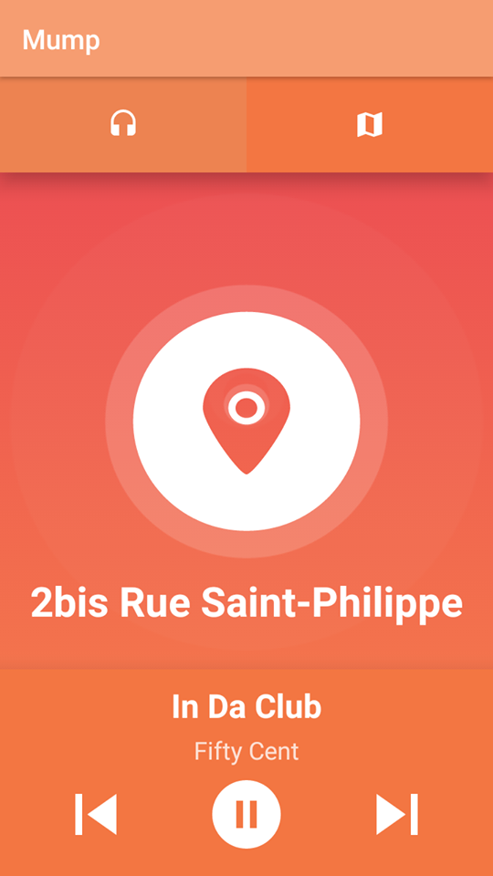

<h1 style="text-align:center;">
  
</h1>
# Mump

Mumpis a mobile application which enables the user to listen music either via what one likes, or via one's location.
In brief, as long as you're walking in the city, Mump decides what should you listen according to what has been listened by others where you are.

# Screenshots

<h1 style="text-align:center,">
  
</h1>

<h1 style="text-align:center,">
  
</h1>

<h1 style="text-align:center,">
  
</h1>
